# Kotlin Playground
連續 30 天學習通過 Kotlin 學習開發 Android App 每一天都會做一個例子，並且將心得記錄在 Blog  [https://android.devdon.com/?page_id=105](https://android.devdon.com/?page_id=105)

## 1 - Tap Counter

[Blog](https://android.devdon.com/?p=35) / [Source Code](https://github.com/slamdon/kotlin-playground/tree/master/1-Tap-Counter) - 2017.11.20

 - Button / Label
 - Event handler
 - Custom menu

## 2 - SeekBar Discount

[Blog](https://android.devdon.com/?p=43) / [Source Code](https://github.com/slamdon/kotlin-playground/tree/master/2-SeekBarPercentage) - 2017.11.21

 - Seekbar
 - EditView
 - Keyboard
 
## 3 - Image Picker

[Blog](https://android.devdon.com/?p=61) / [Source Code](https://github.com/slamdon/kotlin-playground/tree/master/3-ImagePicker) - 2017.11.22

 - put image into AndroidStudio project
 - open Camera/Album through Intent
 - ImageView

## 4 - Scalable ImageView

[Blog](https://android.devdon.com/?p=84) / [Source Code](https://github.com/slamdon/kotlin-playground/tree/master/4-ScalableImageView) - 2017.11.23

 - Custom ImageView (Kotlin file + layout xml)
 - Gesture
 - Coordinates

## 5 - Search on WebView

[Blog](https://android.devdon.com/?p=93) / [Source Code](https://github.com/slamdon/kotlin-playground/tree/master/5-WebSearch) - 2017.11.24

 - Webview
 - Keyboard
 - TextView Event

## 6 - Image List (RecyclerView)

[Blog](https://android.devdon.com/?p=113) / [Source Code](https://github.com/slamdon/kotlin-playground/tree/master/6-ImageList) - 2017.11.25

 - RecyclerView
 - Adapter / ViewHolder
 - model (data class)

## 7 - MyLocation (GoogleMap)

[Blog](https://android.devdon.com/?p=128) / [Source Code](https://github.com/slamdon/kotlin-playground/tree/master/7-MyLocation) - 2017.11.26

 - GoogleMap
 - LocationManager
 - uses-permission
 - change activity by intent

## 8 - BottomNavigation

[Blog](https://android.devdon.com/?p=149) / [Source Code](https://github.com/slamdon/kotlin-playground/tree/master/8-BottomNavigation) - 2017.11.27

 - Fragment
 - BottomNavigation
 - icon in SVG
 - intent with flag

## 9 - ImageSlider
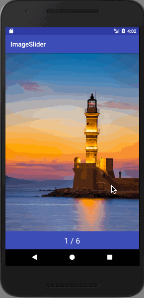

[Blog](https://android.devdon.com/?p=162) / [Source Code](https://github.com/slamdon/kotlin-playground/tree/master/9-ImageSlider) - 2017.11.28

 - ViewPager
 - PagerAdapter
 - Fragment

## 10 - ProgressBarHandler
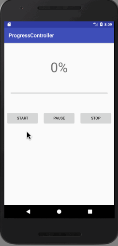

[Blog](https://android.devdon.com/?p=181) / [Source Code](https://github.com/slamdon/kotlin-playground/tree/master/10-ProgressControl) - 2017.11.29

 - ProgressBar
 - Handler

## 11 - ActivitySchedule
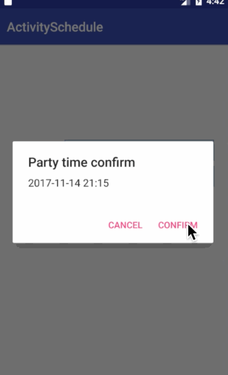

[Blog](https://android.devdon.com/?p=239) / [Source Code](https://github.com/slamdon/kotlin-playground/tree/master/11-ActivitySchedule) - 2017.11.30

 - Calendar
 - DatePickerDialog / TimePickerDialog
 - SimpleDateFormat
 - AlertDialog

## 12 - GithubStars
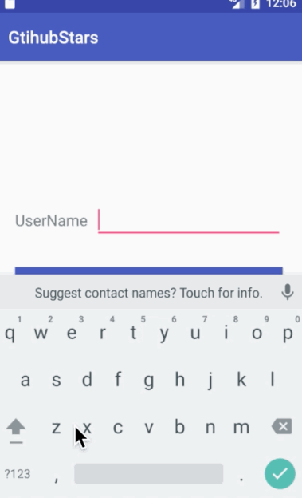

[Blog](https://android.devdon.com/?p=258) / [Source Code](https://github.com/slamdon/kotlin-playground/tree/master/12-GtihubStars) - 2017.12.01

 - OkHttp
 - RecyclerView
 - Intent & Parcelable

## 13 - LocalStorage
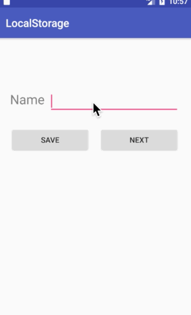

[Blog](https://android.devdon.com/?p=267) / [Source Code](https://github.com/slamdon/kotlin-playground/tree/master/13-LocalStorage) - 2017.12.02

 - SharedPreferences

## 14 - Ball
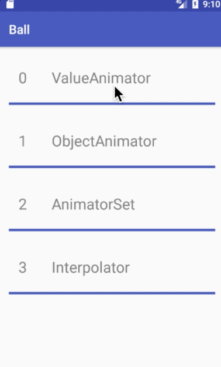

[Blog](https://android.devdon.com/?p=273) / [Source Code](https://github.com/slamdon/kotlin-playground/tree/master/14-Ball) - 2017.12.03

 - ValueAnimator
 - ObjectAnimator
 - AnimatorSet

## 15 - Notification
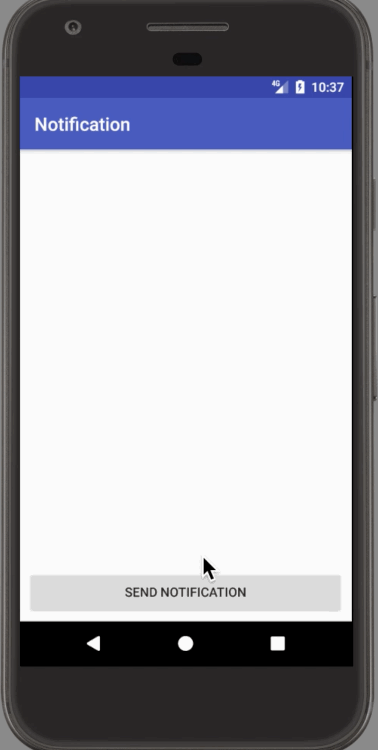

[Blog](https://android.devdon.com/?p=281) / [Source Code](https://github.com/slamdon/kotlin-playground/tree/master/15-Notification) - 2017.12.04

 - Notification.Builder
 - NotificationManager

## 16 - PushMessaging
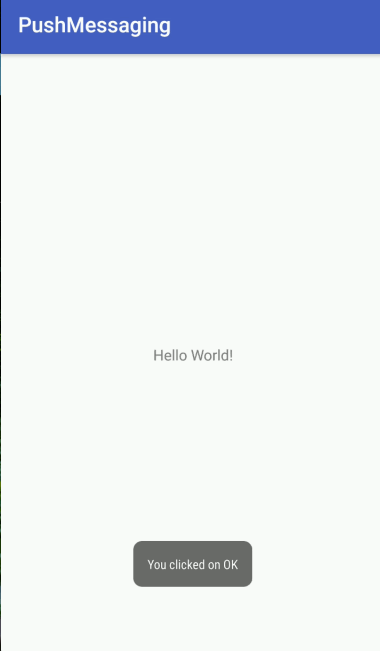

[Blog](https://android.devdon.com/?p=306) / [Source Code](https://github.com/slamdon/kotlin-playground/tree/master/16-PushMessaging) - 2017.12.05

 - Firebase
 - BroadcastReceiver

## 17 - PullToRequest
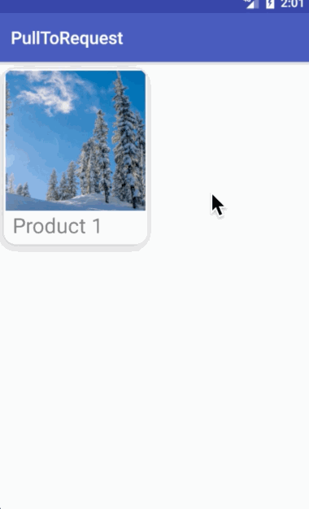

[Blog](https://android.devdon.com/?p=322) / [Source Code](https://github.com/slamdon/kotlin-playground/tree/master/17-PullToRequest)

 - GridLayoutManager
 - CardView
 - SwipeRefreshLayout
 
## 18 - SlideMenu
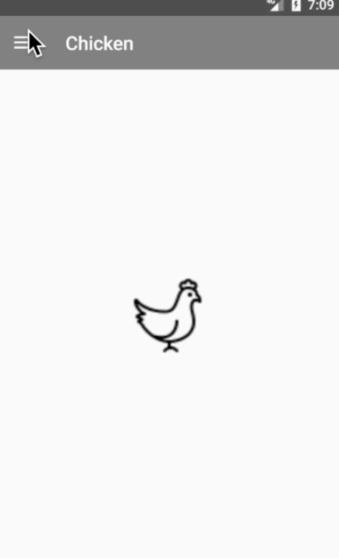

[Blog](https://android.devdon.com/?p=341) / [Source Code](https://github.com/slamdon/kotlin-playground/tree/master/18-SideMenu)

 - DrawerActivity
 - NavigationView
 - Toolbar

## 19 - LittleBirdSound
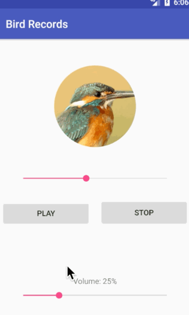

[Blog](https://android.devdon.com/archives/354) / [Source Code](https://github.com/slamdon/kotlin-playground/tree/master/19-LittleBirdSound)

 - MediaPlayer
 - MediaRecorder

# 20 - ActivityTransition

[Blog](https://android.devdon.com/archives/379) / [Source Code](https://github.com/slamdon/kotlin-playground/tree/master/20-ActivityTransition)

 - Transition

