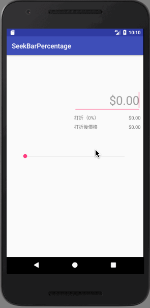
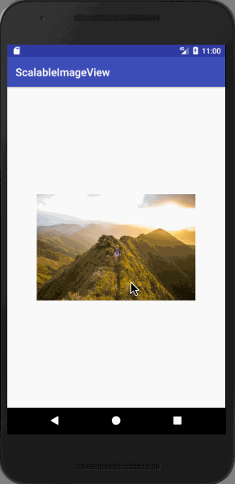
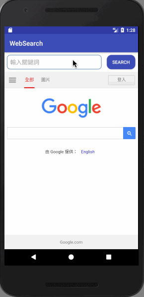
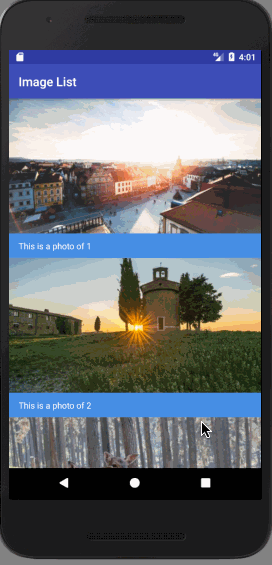
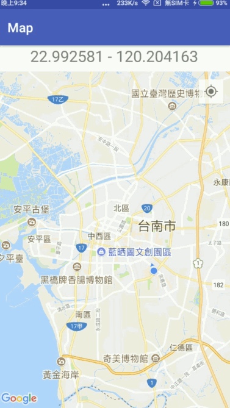
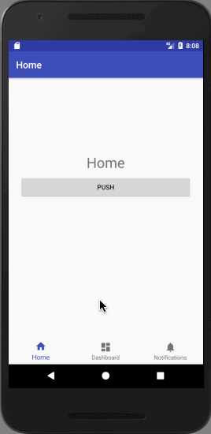

# Kotlin Playground
學習通過 Kotlin 開發 Android App

## 1 - Tap Counter

[Blog](https://android.devdon.com/?p=35) / [Source Code](https://github.com/slamdon/kotlin-playground/tree/master/1-Tap-Counter) - 2017.11.20

 - Button / Label
 - Event handler
 - Custom menu

## 2 - SeekBar Discount

[Blog](https://android.devdon.com/?p=43) / [Source Code](https://github.com/slamdon/kotlin-playground/tree/master/2-SeekBarPercentage) - 2017.11.21

 - Seekbar
 - EditView
 - Keyboard
 
## 3 - Image Picker

[Blog](https://android.devdon.com/?p=61) / [Source Code](https://github.com/slamdon/kotlin-playground/tree/master/3-ImagePicker) - 2017.11.22

 - put image into AndroidStudio project
 - open Camera/Album through Intent
 - ImageView

## 4 - Scalable ImageView

[Blog](https://android.devdon.com/?p=84) / [Source Code](https://github.com/slamdon/kotlin-playground/tree/master/4-ScalableImageView) - 2017.11.23

 - Custom ImageView (Kotlin file + layout xml)
 - Gesture
 - Coordinates

## 5 - Search on WebView

[Blog](https://android.devdon.com/?p=93) / [Source Code](https://github.com/slamdon/kotlin-playground/tree/master/5-WebSearch) - 2017.11.24

 - Webview
 - Keyboard
 - TextView Event

## 6 - Image List (RecyclerView)

[Blog](https://android.devdon.com/?p=113) / [Source Code](https://github.com/slamdon/kotlin-playground/tree/master/6-ImageList) - 2017.11.25

 - RecyclerView
 - Adapter / ViewHolder
 - model (data class)

## 7 - MyLocation (GoogleMap)

[Blog](https://android.devdon.com/?p=128) / [Source Code](https://github.com/slamdon/kotlin-playground/tree/master/7-MyLocation) - 2017.11.26

 - GoogleMap
 - LocationManager
 - uses-permission
 - change activity by intent

## 8 - BottomNavigation

[Blog](https://android.devdon.com/?p=149) / [Source Code](https://github.com/slamdon/kotlin-playground/tree/master/7-MyLocation) - 2017.11.27