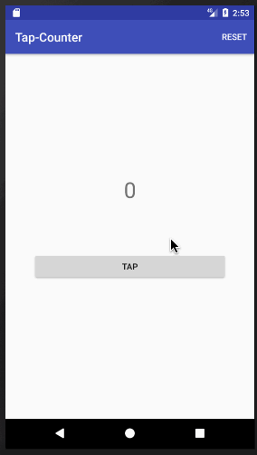
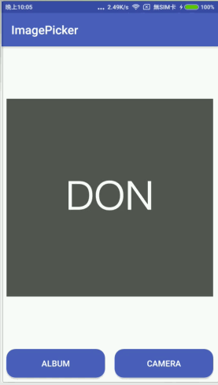

# Kotlin Playground
學習通過 Kotlin 開發 Android App

## 1 - Tap Counter

[Blog](https://android.devdon.com/?p=35) / [Source Code](https://github.com/slamdon/kotlin-playground/tree/master/1-Tap-Counter) - 2017.11.20

 - Button / Label
 - Event handler
 - Custom menu

## 2 - SeekBar 打折計算

[Blog](https://android.devdon.com/?p=43) / [Source Code](https://github.com/slamdon/kotlin-playground/tree/master/2-SeekBarPercentage) - 2017.11.21

 - Seekbar
 - EditView
 - Keyboard
 
## 3 - Image Picker

[Blog](https://android.devdon.com/?p=61) - 2017.11.22

 - put image into AndroidStudio project
 - open Camera/Album through Intent
 - ImageView